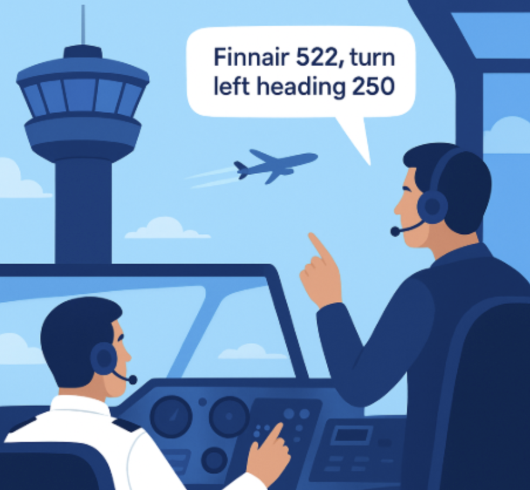

# ATC-Pilot Chat



**PrivateAI-PilotChat** is an open-source, fully offline real-time ATC–pilot voice communication simulator.
It allows you to practice realistic air traffic control phraseology and pilot exchanges entirely on your local system.

All processing — speech recognition, command interpretation, and voice synthesis — happens locally:
No cloud. No data sharing. No subscriptions. 100% private and free.
Tested and safe components only.

---

## Hardware & System Requirements

* Works on **GPU and CPU**. GPU is optional but speeds up processing.
* **Python 3.10+** recommended.
* **RAM:** ≥8GB

---

## Pipeline Runtime

* **GPU (≥2GB VRAM):** ~0.3 seconds per command
* **CPU only:** ~1.2 seconds per command

---

## Text-to-Speech Options

* **Full-featured TTS (`text_to_speech.py`)**: High-quality multi-voice output (~3s per response on RTX 5090).
* **Fast TTS (`text_to_speech_fast.py`)**: Very quick (<1s on CPU), single voice.

---

## Quick Start

1. **Clone the repository**

   ```bash
   git clone https://github.com/Saukkoriipi/PrivateAI-PilotChat.git
   cd PrivateAI-PilotChat
   ```

2. **Create virtual environment and activate**

   ```bash
   python3 -m venv venv
   source venv/bin/activate   # Linux/macOS
   venv\Scripts\activate      # Windows
   ```

3. **Install dependencies**

   ```bash
   pip install -r requirements.txt
   ```

4. **Run the pipeline**

   ```bash
   python3 chat.py
   ```

---

## Usage

* Speak your ATC instruction into the microphone.
* The system will:

  1. Transcribe your audio to text
  2. Parse ATC commands into structured JSON
  3. Generate ICAO-style pilot readback
  4. Produce a synthetic pilot voice
  5. Log commands as JSON and CSV formats

> ⚠️ ICAO recommends a radiotelephony rate ≤100 words per minute for clarity.
> Speaking faster may reduce recognition accuracy.

---

## Supported ATC Commands

| Type              | Example                               |
| ----------------- | ------------------------------------- |
| Vectoring         | TURN LEFT HEADING 270                 |
| Altitudes         | CLIMB TO FL280 / DESCEND TO 4000 FEET |
| QNH / Altimeter   | QNH 1013                              |
| Speed             | REDUCE SPEED TO 210 KNOTS             |
| Clearance         | CLEARED DIRECT LAKUT                  |
| Approach / Runway | ILS APPROACH RUNWAY 22                |

---

## Features

* Fully offline operation
* Voice input/output
* Structured reasoning (JSON output)
* Multi-voice or fast single-voice TTS
* Privacy-first design

---

## Project Structure

```
pipeline/
 ├── airline_matcher.py       # Handles matching spoken callsigns to ICAO codes
 ├── airlines.csv             # Airline data (ICAO, CALLSIGN, PRONUNCIATION)
 ├── csv_logger.py            # Logs parsed ATC commands to CSV
 ├── json_to_pilot_reply.py   # Converts parsed JSON to ICAO-style pilot readback
 ├── pipeline.py              # Main ATC-to-Pilot pipeline orchestrator
 ├── speech_to_text.py        # ASR: ATC audio → text
 ├── text_to_json.py          # ATC text → structured JSON
 ├── text_to_speech.py        # Full-featured pilot TTS (multi-voice)
 └── text_to_speech_fast.py   # Fast pilot TTS (single voice)
```

---

## Audio Examples

### Example 1 — British Airways

**ATC Command:**  
`BAW327 turn left heading 270 descend to flight level 280`

**Input Audio:**

<audio controls>
  <source src="demo/input/atc1.wav" type="audio/wav">
  Your browser does not support the audio element.
</audio>

**Pilot Response:**

<audio controls>
  <source src="demo/output/atc1.wav" type="audio/wav">
  Your browser does not support the audio element.
</audio>

---

### Example 2 — Delta Airlines

**ATC Command:**  
`DAL209 turn right heading 180 descend to 4000 feet qnh 998 reduce speed to 210 knots`

**Input Audio:**

<audio controls>
  <source src="demo/input/atc2.wav" type="audio/wav">
  Your browser does not support the audio element.
</audio>

**Pilot Response:**

<audio controls>
  <source src="demo/output/atc2.wav" type="audio/wav">
  Your browser does not support the audio element.
</audio>

### Example 3 — Finnair

**ATC Command:**  
`FIN522 turn left heading 250 descent to flight level 360`

**Input Audio:**

<audio controls>
  <source src="demo/input/atc3.wav" type="audio/wav">
  Your browser does not support the audio element.
</audio>

**Pilot Response:**

<audio controls>
  <source src="demo/output/atc3.wav" type="audio/wav">
  Your browser does not support the audio element.
</audio>

---

## Extensibility

* Swap ASR or TTS engines
* Add custom JSON fields or new commands
* Integrate with flight simulators

---

## License

MIT License — free to use, modify, and distribute with attribution.

---