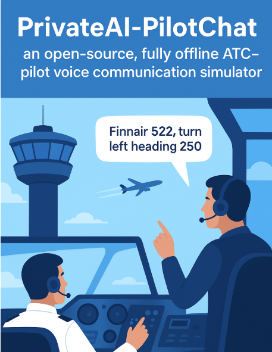

# ATC-Pilot Chat



**PrivateAI-PilotChat** is an open-source, fully offline, real-time ATC–pilot voice communication simulator. It lets you practice realistic air traffic control phraseology, pronunciation, and exchanges with a virtual pilot entirely on your local system.

All processing — speech recognition, command parsing, and voice synthesis — happens locally. No cloud. No data sharing. No subscriptions. 100% private, free, and built with tested, safe components.

**Best part:** A normal home laptop is enough to run it in real time.

---

## Audio Examples

### Example 1 — Delta Airlines

**ATC Command:**  
`DAL209 turn right heading 180 descend to 4000 feet qnh 998 reduce speed to 210 knots`

**Input Audio:**

[Listen (opens in Google Drive)](https://drive.google.com/file/d/10VbqSBkJ-lZTmbGGOSGiS9UfzBnmQ9d9/view?usp=drive_link)

**Pilot Response:**

[Listen (opens in Google Drive)](https://drive.google.com/file/d/10QAltXYhR5v1iX8evDpDaxGLAgBfaSgY/view?usp=drive_link)

**Command as JSON (auto-parsed from ATC input audio):**

```json
{
  "icao": "DAL209",
  "callsign": "DELTA209",
  "turn_direction": "right",
  "heading": 180,
  "vertical_movement": "descent",
  "to_altitude": "4000ft",
  "speed_movement": "reduce",
  "speed": "210kts",
  "qnh": "998"
}
```

---

### Example 2 — British Airways

**ATC Command:**  
`BAW327 turn left heading 270 descend to flight level 280`

**Input Audio:**

[Listen (opens in Google Drive)](https://drive.google.com/file/d/1VYb6P2VGolAAl2r_xW2yQiAihcrEgbY_/view?usp=drive_link)

**Pilot Response:**

[Listen (opens in Google Drive)](https://drive.google.com/file/d/1RgVe5ugu3uSvGjjcMisQr9_khSHtiX80/view?usp=drive_link)


**Command as JSON (auto-parsed from ATC input audio):**

```json
{
  "icao": "BAW327",
  "callsign": "SPEEDBIRD327",
  "turn_direction": "left",
  "heading": 270,
  "vertical_movement": "descent",
  "to_altitude": "FL280"
}
```

---

### Example 3 — Finnair

**ATC Command:**  
`FIN522 turn left heading 250 descent to flight level 360`

**Input Audio:**

[Listen (opens in Google Drive)](https://drive.google.com/file/d/1Pv_BKutIgZseeS8AXTAhkxF0PGs5qn4E/view?usp=drive_link)

**Pilot Response:**

[Listen (opens in Google Drive)](https://drive.google.com/file/d/1hQkJaA6s2mW_fS4irdaBUbb455Djd-Oz/view?usp=drive_link)


**Command as JSON (auto-parsed from ATC input audio):**

```json
{
    "icao": "FIN522",
    "callsign": "FINNAIR522",
    "turn_direction": "left",
    "heading": 250,
    "vertical_movement": "descent",
    "to_altitude": "FL360"
}
```

---

## Hardware & System Requirements

* Works on **GPU and CPU**. GPU is optional but speeds up processing.
* **Python 3.10+** recommended.
* **RAM:** ≥8GB

---

## Pipeline Runtime

* **GPU (≥2GB VRAM):** ~0.3 seconds per command
* **CPU only:** ~1.2 seconds per command

---

## Text-to-Speech Options

* **Full-featured TTS (`text_to_speech.py`)**: High-quality multi-voice output (~3s per response on RTX 5090).
* **Fast TTS (`text_to_speech_fast.py`)**: Very quick (<1s on CPU), single voice.

---

## Quick Start

1. **Clone the repository**

   ```bash
   git clone https://github.com/Saukkoriipi/PrivateAI-PilotChat.git
   cd PrivateAI-PilotChat
   ```

2. **Create virtual environment and activate**

   ```bash
   python3 -m venv venv
   source venv/bin/activate   # Linux/macOS
   venv\Scripts\activate      # Windows
   ```

3. **Install dependencies**

   ```bash
   pip install -r requirements.txt
   ```

4. **Run the pipeline**

   ```bash
   python3 chat.py
   ```

---

## Usage

* Speak your ATC instruction into the microphone.
* The system will:

  1. Transcribe your audio into text
  2. Parse the text into structured ATC JSON commands
  3. Generate ICAO-style pilot readback text
  4. Convert the text to synthetic pilot audio
  5. Play the pilot audio
  6. Log commands in both JSON and CSV formats

---

## Supported ATC Commands

| Type              | Example                               |
| ----------------- | ------------------------------------- |
| Vectoring         | TURN LEFT HEADING 270                 |
| Altitudes         | CLIMB TO FL280 / DESCEND TO 4000 FEET |
| QNH / Altimeter   | QNH 1013                              |
| Speed             | REDUCE SPEED TO 210 KNOTS             |
| Clearance         | CLEARED DIRECT LAKUT                  |
| Approach / Runway | CLEARED ILS APPROACH RUNWAY 22        |


---

## Project Structure

```
pipeline/
 ├── airline_matcher.py       # Handles matching spoken callsigns to ICAO codes
 ├── airlines.csv             # Airline data (ICAO, CALLSIGN, PRONUNCIATION)
 ├── csv_logger.py            # Logs parsed ATC commands to CSV
 ├── json_to_pilot_reply.py   # Converts parsed JSON to ICAO-style pilot readback
 ├── pipeline.py              # Main ATC-to-Pilot pipeline orchestrator
 ├── speech_to_text.py        # ASR: ATC audio → text
 ├── text_to_json.py          # ATC text → structured JSON
 ├── text_to_speech.py        # Full-featured pilot TTS (multi-voice)
 └── text_to_speech_fast.py   # Fast pilot TTS (single voice)
```

---

## Notes
* The **ICAO recommends** a radiotelephony rate of **≤100 words per minute** to ensure clarity. Speaking faster may increase recognition errors in the system.
* Only **predefined airlines** are recognized. The list is located at `pipeline/airlines.csv`. You can **edit this file** to add or remove recognizable callsigns.
* The **simulator expects callsigns** to start with letters and end with numbers. For example, `AAL102` is valid, but `DLH5PP` is not.
* In testing, the system is mostly robust. **Most common errors occur in the callsign**. For this reason, `pipeline/airlines.csv` allows users to add **more than one acceptable pronunciation per airline**.
* To **further improve the pipeline**, focus on **audio-to-parsed command translation**. Precomputing pronunciation options for standard phraseology can make runtime matching more robust with minimal overhead. LLM-based approaches (we tested this) also work but are too slow for fully real-time, local use. Conversion from parsed command → text → audio is relatively trivial task.
* Future plan: integrate **ATC-Pilot Chat** into **Bluesky ATC Simulator** ([PyPI link](https://pypi.org/project/bluesky-simulator/)) for a fully voice-driven ATC simulation experience.

---

## License

MIT License — free to use, modify, and distribute with attribution.

---